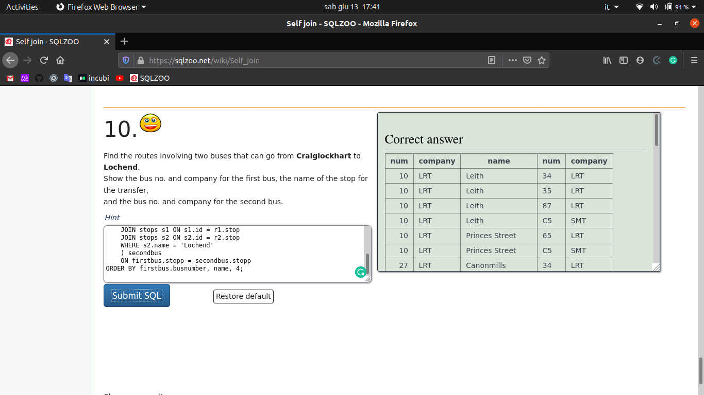

# SQL Databse

> This project is about experimenting and exercise with different MySQL commands and tecniques



It was made using SqlZoo tutorial from basics to self-join.

## Built With

- SQL Zoo tutorial
- Vs Code
- MySQL


### Usage
Copy and paste these solutions to the exercises from the SQL Zoo Wiki.

### Cloning 

You can also clone this repo:

# Open your terminal

Type :
``` git clone https://github.com/ioilmio/sql-zoo.git ```


## Advice

Try to run small queries, look at the result, build upon them.


👤 **Ioilmio**
- Github: [@ioilmio](https://github.com/ioilmio)
- Twitter: [@ioilmio](https://twitter.com/ioilmio)
- Linkedin: [Illuminato Salvatore](https://www.linkedin.com/in/illuminato-salvatore/)


## 🤝 Contributing

Contributions, issues and feature requests are welcome!

Feel free to check the [issues page](https://github.com/ioilmio/sql-zoo/issues).

## Show your support

Give a ⭐️ if you like this project!

## Acknowledgments

- Microverse
- SqlZoo
- SqlBolt
- GalaxQL
- Stackoverflow

## 📝 License

This project is [MIT](lic.url) licensed.
